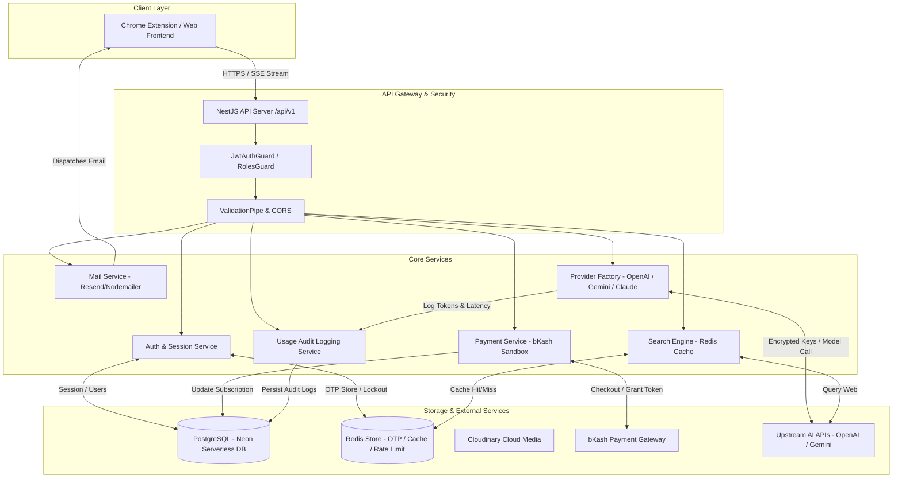

# 🚀 EchoGPT Backend — Project Architecture & Technical Documentation

> **Target Audience:** Technical Recruiters, Engineering Leads, & Hiring Managers  
> **Author:** Sohag Ali (Aspiring Backend Developer / Software Engineer)  
> **Live API Base URL:** `https://echogptbackend-production.up.railway.app/api/v1`  
> **Swagger Documentation:** `https://echogptbackend-production.up.railway.app/api/docs`  
> **Postman Interactive Docs:** [documenter.getpostman.com/view/54817904/2sBYB4K6is](https://documenter.getpostman.com/view/54817904/2sBYB4K6is)  
> **DrawSQL Database ERD:** [drawsql.app/teams/mdsohag-ali/diagrams/echogpt](https://drawsql.app/teams/mdsohag-ali/diagrams/echogpt)  
> **GitHub Repository:** [Sohag-Ali/EchoGpt_Backend](https://github.com/Sohag-Ali/EchoGpt_Backend)

---

## 📑 Table of Contents
1. [Project Overview & Executive Summary](#1-project-overview--executive-summary)
2. [High-Level System Architecture](#2-high-level-system-architecture)
3. [Technology Stack & Architectural Rationale](#3-technology-stack--architectural-rationale)
4. [Authentication, Security & Session Management](#4-authentication-security--session-management)
5. [Mail Service & Email Dispatch Pipeline (Resend & Nodemailer)](#5-mail-service--email-dispatch-pipeline-resend--nodemailer)
6. [Monetization & bKash Tokenized Payment Integration](#6-monetization--bkash-tokenized-payment-integration)
7. [AI Chat Engine, Provider Factory & SSE Real-Time Streaming](#7-ai-chat-engine-provider-factory--sse-real-time-streaming)
8. [Web Search Engine & Multi-Tier Redis Caching](#8-web-search-engine--multi-tier-redis-caching)
9. [Centralized API Usage Audit Logging & Monitoring](#9-centralized-api-usage-audit-logging--monitoring)
10. [Database Schema & Multi-File Prisma Architecture](#10-database-schema--multi-file-prisma-architecture)
11. [Admin Administration & Analytics Dashboard](#11-admin-administration--analytics-dashboard)
12. [Testing Strategy & Production Hardening](#12-testing-strategy--production-hardening)

---

## 1. Project Overview & Executive Summary

**EchoGPT Backend** is an enterprise-grade, production-ready RESTful API and real-time streaming engine built to power AI assistant clients (such as Chrome Extensions, Web Portals, and Mobile Apps). 

The platform is designed to solve core backend engineering challenges in the LLM era:
- **Multi-Vendor AI Provider Lock-in:** Seamlessly switching between OpenAI (`gpt-4o`), Google Gemini (`gemini-3.8-flash`), and Anthropic Claude via a unified **Factory Pattern**.
- **Real-Time Data Delivery:** Sub-second interactive response streaming using **Server-Sent Events (SSE)**.
- **Monetization & Quota Enforcement:** Protecting upstream LLM costs by enforcing pre-execution monthly request quotas (`FREE`: 50 req/month vs `PREMIUM`), paired with automated **bKash Tokenized Payment** verification.
- **Low-Latency Search Acceleration:** Integrated live web search powered by a **Redis Caching Layer** (`ioredis`) for sub-millisecond repeated query responses.
- **Enterprise Security & Auditability:** AES-256-GCM API key encryption, dual-token JWT security with HttpOnly cookie delivery, Redis-backed OTP rate-limiting, and microsecond-accurate API audit logging.

---

## 2. High-Level System Architecture



---

## 3. Technology Stack & Architectural Rationale

| Category | Technology | Version | Key Reason for Selection |
| :--- | :--- | :--- | :--- |
| **Framework** | **NestJS** | `v12.0.1` | Enterprise Angular-inspired TypeScript framework providing strict dependency injection, modularity, and clean separation of concerns. |
| **Language** | **TypeScript** | `v6.0.2` | Complete type-safety across models, DTOs, and services, preventing runtime `NullPointer` and `Undefined` exceptions. |
| **Database** | **PostgreSQL (Neon)** | `v16` | Serverless relational database for ACID-compliant transactions (payments, user accounts, subscriptions). |
| **ORM** | **Prisma ORM** | `v6.4.1` | Type-safe database queries featuring a clean multi-file schema structure for high maintainability. |
| **Caching Store** | **Redis (ioredis)** | `v6.0.0` | Ultra-fast in-memory cache for OTP storage, search result caching, and brute-force attempt tracking. |
| **Real-Time** | **Server-Sent Events** | Standard SSE | Lightweight HTTP streaming (`text/event-stream`) ideal for LLM text completion streaming. |
| **Email Engine** | **Resend API / SMTP** | `Resend v4` | Transactional email delivery with fallback Nodemailer support for OTPs and verification. |
| **Payment Gateway**| **bKash Tokenized** | `v1.2.0-beta` | Top mobile wallet integration in Bangladesh featuring automated grant-token execution. |
| **Cloud Storage** | **Cloudinary** | `v2.11.0` | Direct buffer-to-cloud profile image optimization without local disk persistence. |
| **Testing** | **Vitest** | `v4.1.2` | Next-generation fast unit and End-to-End (E2E) integration test runner. |

---

## 4. Authentication, Security & Session Management

```text
                  +-----------------------------------+
                  |   User Registration / Login Flow  |
                  +-----------------------------------+
                                    │
    ┌───────────────────────────────┴───────────────────────────────┐
    ▼                                                               ▼
[Email + Password Registration]                               [Google OAuth2 Sign-In]
    │                                                               │
    ├─► Generate 6-Digit Numeric OTP                                ├─► Receive Google ID Token
    ├─► Store Hashed OTP in Redis (5-min TTL, Max 5 Attempts)       ├─► Verify Token via google-auth-library
    ├─► Dispatch Email via Resend API / Nodemailer                  ├─► Extract Email, Name, Avatar URL
    │                                                               │
    ▼                                                               ▼
[POST /auth/verify-registration]                             [Check or Provision User Account]
    │                                                               │
    └───────────────────────────────┬───────────────────────────────┘
                                    │
                                    ▼
                 +--------------------------------------+
                 | Atomically Provision DB Entities:    |
                 |  1. User Record                      |
                 |  2. UserProfile (Bio, Avatar, etc)  |
                 |  3. Subscription (FREE: 50 req/mo)   |
                 +--------------------------------------+
                                    │
                                    ▼
                 +--------------------------------------+
                 | Issue Dual JWT Security Tokens:       |
                 |  - Access Token (24h)                |
                 |  - Refresh Token (7d in HttpOnly Cookie)|
                 |  - Register Session in DB            |
                 +--------------------------------------+
```

### Key Security Implementations:
1. **Password Hashing:** Passwords are non-reversibly hashed using `bcrypt` with dynamic salt generation.
2. **Brute-Force Protection:** Redis tracks verification attempts per email. After 5 failed attempts, registration/OTP validation is locked for 15 minutes.
3. **Session Revocation:** Every user login registers a `Session` record in PostgreSQL with a hashed `refreshToken`. When a user logs out or resets their password, sessions are revoked globally.
4. **Role-Based Access Control (RBAC):** Admin endpoints are protected by `@Roles(RoleType.ADMIN)` combined with custom `RolesGuard` and `JwtAuthGuard`.

---

## 5. Mail Service & Email Dispatch Pipeline (Resend & Nodemailer)

The email dispatch architecture (`MailService` & `EmailTemplateService`) guarantees high delivery rates, beautiful responsive HTML templates, and dev-mode resilience.

### Architecture & Flow of Email Sending:

```text
               +--------------------------------------+
               |    MailService.dispatchEmail()       |
               +--------------------------------------+
                                  │
                  ┌───────────────┴───────────────┐
                  ▼                               ▼
       [Resend API Key Exists?]         [No Credentials (Dev Mode)]
                  │                               │
         ┌────────┴────────┐                      ▼
        YES                NO             Log Full Content to Console
         │                 │
         ▼                 ▼
   Resend SDK      Fallback to Nodemailer
   HTTP Client     SMTP Transporter
         │                 │
         └────────┬────────┘
                  │
                  ▼
   Send Responsive HTML Template 
   (OTP / Verification / Reset / Welcome)
```

### Standard Email Workflows:
1. **Registration OTP (`sendRegistrationOtpEmail`):** Sends a 6-digit verification code with a 5-minute expiration notice.
2. **Password Reset OTP (`sendPasswordResetEmail`):** Delivers a secure reset OTP to prevent unauthorized account takeovers.
3. **Password Reset Confirmation (`sendPasswordResetSuccessEmail`):** Sends a security notification immediately after password updates.
4. **Welcome Email (`sendWelcomeEmail`):** Welcomes newly verified users and outlines platform capabilities.

---

## 6. Monetization & bKash Tokenized Payment Integration

EchoGPT implements a complete end-to-end tokenized payment pipeline using Bangladesh’s leading mobile financial service gateway (**bKash Tokenized API v1.2**).

### Detailed bKash Checkout & Subscription Upgrade Flow:

```text
User Request: POST /api/v1/payments/bkash/initiate
   │
   ├─► 1. Check if user already has an active payment pending.
   ├─► 2. Generate Unique Invoice ID (`INV-XXXXXX`) & Create PENDING Payment in DB.
   ├─► 3. Authenticate with bKash API -> Issue Grant Token (`POST /tokenized/checkout/token/grant`).
   ├─► 4. Call bKash Checkout API (`POST /tokenized/checkout/create`).
   └─► 5. Return bKash Payment URL (`bkashURL`) & `paymentID` to Client.
   │
   ▼
User Redirected to bKash Gateway (Inputs bKash Mobile No & PIN)
   │
   ▼
bKash Gateway Redirects to Backend Callback: GET /api/v1/payments/bkash/callback
   │
   ├─► 1. Intercept `paymentID` and `status` (success / cancel / failure).
   ├─► 2. Execute Payment (`POST /tokenized/checkout/execute`).
   ├─► 3. Verify Response `statusCode === '0000'` & Extract `trxID`.
   ├─► 4. Atomically Execute PostgreSQL DB Transaction:
   │      - Mark Payment Status = `COMPLETED`.
   │      - Upgrade Subscription Plan = `PREMIUM`.
   │      - Set Subscription Status = `ACTIVE`.
   │      - Reset `usedRequests` = 0.
   └─► 5. Redirect User to Frontend Success Page with Transaction Details.
```

### 🧪 bKash Sandbox Test Credentials:
Use the following test credentials on the bKash Sandbox checkout page:
* **Wallet Number:** `01770618576`
* **Verification Code (OTP):** `123456`
* **bKash PIN:** `12121`

---

## 7. AI Chat Engine, Provider Factory & SSE Real-Time Streaming

To prevent vendor lock-in and enable zero-downtime AI model switches, EchoGPT uses the **Factory Design Pattern** (`ProviderFactory`).

```text
Client Application (POST /api/v1/chats or /chats/stream)
   │
   ▼
SubscriptionsGuard / Service: Enforce Monthly Request Quota Limit (FREE = 50 req/month)
   │
   ▼
ProviderFactory: Resolve Target Provider (OpenAI / Gemini / Anthropic)
   │
   ├─► Retrieve API Key from DB (`ai_providers` table).
   ├─► Decrypt API Key using AES-256-GCM (`CryptoUtil.decrypt`).
   └─► Instantiate Provider Service dynamically.
   │
   ▼
Provider Execution:
   ├── Standard REST Response: Return complete JSON response.
   └── SSE Streaming (`/chats/stream`): Chunked transfer (`text/event-stream`).
   │
   ▼
Post-Execution Audit:
   └─► UsageLogsService: Record prompt tokens, completion tokens, latency (ms), and USD cost.
```

---

## 8. Web Search Engine & Multi-Tier Redis Caching

The Web Search Engine enables LLMs to answer real-time queries with live internet data while maintaining low latency through Redis query hashing.

```text
User Search Request (query: "Latest Tech News")
   │
   ▼
Hash Query Key -> "search:cache:<sha256_hash>"
   │
   ▼
SearchCacheService checks Redis Store
   │
   ├── [CACHE HIT] ──► Return Cached JSON Data (Latency: ~2ms, Cost: $0.00)
   │
   └── [CACHE MISS] ─► 1. Execute Live Web Search Engine Query.
                       2. Store Results in Redis with Configured TTL (e.g., 24 Hours).
                       3. Persist Search Record in PostgreSQL `web_searches` table.
                       4. Log Audit Log Record in `api_usage_logs`.
```

---

## 9. Centralized API Usage Audit Logging & Monitoring

Every AI model invocation and web search request automatically records an immutable audit log entry in PostgreSQL via `UsageLogsService`:

| Column Name | Data Type | Purpose & Significance |
| :--- | :--- | :--- |
| `id` | `UUID` | Unique primary key identifier for the audit log. |
| `user_id` | `UUID (FK)` | Relates request directly to the authenticating user. |
| `provider_id` | `UUID (FK)` | Tracks specific AI Provider (OpenAI, Gemini, etc.). |
| `request_type` | `Enum` | `CHAT`, `CHAT_STREAM`, or `WEB_SEARCH`. |
| `model_name` | `String` | Model version (e.g., `gpt-4o`, `gemini-3.8-flash`). |
| `prompt_tokens` | `Int` | Number of tokens consumed by input prompt. |
| `completion_tokens` | `Int` | Number of tokens generated in AI output response. |
| `total_tokens` | `Int` | Total tokens consumed (`prompt_tokens + completion_tokens`). |
| `estimated_cost` | `Float` | Micro-calculated USD cost based on provider rate limits. |
| `latency_ms` | `Int` | Exact round-trip execution latency in milliseconds. |
| `status` | `Enum` | Execution outcome: `SUCCESS` or `FAILED`. |

---

## 10. Database Schema & Multi-File Prisma Architecture

EchoGPT utilizes a modular multi-file Prisma schema setup located in `prisma/models/`:

```text
prisma/
├── schema.prisma            # Root DataSource (PostgreSQL) & Generator Config
├── models/
│   ├── user.prisma          # User & UserProfile (1-to-1 Cascade)
│   ├── role.prisma          # Role & RoleType Enum (USER, PREMIUM_USER, ADMIN)
│   ├── session.prisma       # Active Session tracking & JWT Revocation
│   ├── subscription.prisma  # Subscription Plans (FREE, PREMIUM) & Limits
│   ├── payment.prisma       # bKash Payment records, Invoices & Transaction IDs
│   ├── ai-provider.prisma   # AI Providers, Encrypted Keys & Rates
│   ├── chat.prisma          # Chat Threads & Message Entities
│   ├── web-search.prisma    # Web Search Queries & JSON Results
│   ├── api-usage-log.prisma # Centralized Audit Log Entity
│   └── token.prisma         # OTP & Password Reset Token Models
└── migrations/              # Version-controlled SQL migration files
```

---

## 11. Admin Administration & Analytics Dashboard

The platform includes a administrative suite accessible exclusively to users with the `ADMIN` role:

- **Metrics Dashboard (`GET /api/v1/admin/dashboard`):** Real-time analytics displaying Total Users, Active Subscriptions, Total Monthly Requests, System Latency, and Provider Health.
- **User Management (`GET/PATCH/DELETE /api/v1/admin/users`):** Paginated directory to search users, modify roles (`USER` <-> `ADMIN`), toggle account active status, and perform administrative user deletion.
- **AI Provider Management (`/api/v1/admin/providers`):** Interface to add new AI providers, update encrypted API keys, set platform default models, and trigger real-time provider health checks (`AiProviderHealthService`).

---

## 12. Testing Strategy & Production Hardening

### Automated Testing Suite (Vitest):
- **Unit Testing (`npm run test`):** Rigorous unit tests covering services, guards, utility helpers, and provider factories.
- **E2E Integration Testing (`npm run test:e2e`):** End-to-end HTTP request testing validating complete flows (Auth -> Token -> Payment -> SSE Stream).
- **Test Coverage (`npm run test:cov`):** V8 coverage reporting ensuring high code reliability.

### Production Hardening Features:
1. **Payload Sanitation:** Global `ValidationPipe` configured with `whitelist: true` and `forbidNonWhitelisted: true` to reject malicious field injections.
2. **CORS Hardening:** Configured cross-origin policy allowing credentials via secure headers.
3. **Environment Injection Safety:** Centralized configuration service (`@nestjs/config`) with Joi schema validation enforcing required environment variables on server boot.

---

<div align="center">

**Developed with ❤️ by Sohag Ali**  
*Aspiring Software Engineer / Backend Specialist*  
[Portfolio](https://sohagali.me) • [LinkedIn](https://www.linkedin.com/in/sohag-ali-bd) • [GitHub](https://github.com/Sohag-Ali)

</div>
