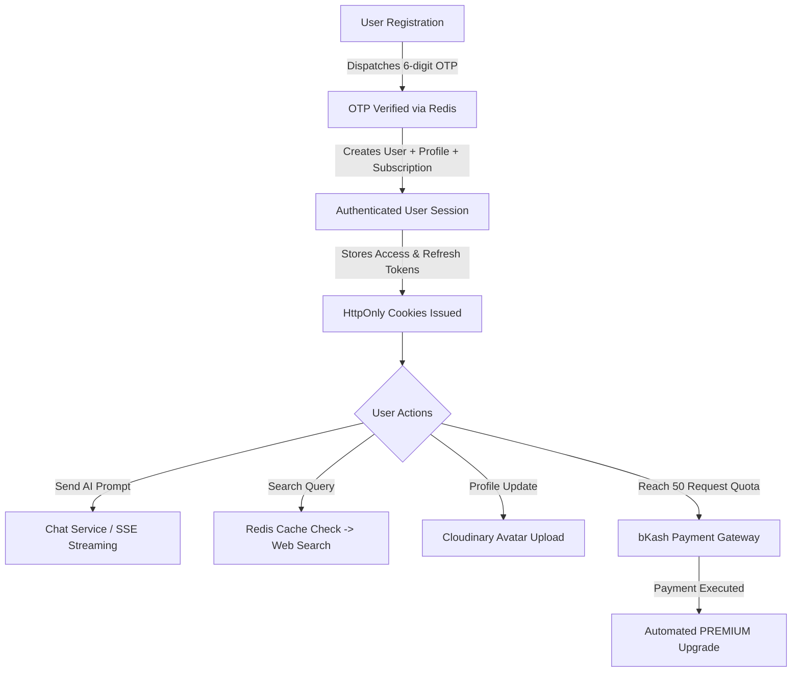

<div align="center">

# EchoGPT Backend API

**Production-Grade RESTful API & Real-Time SSE Streaming Engine for EchoGPT**

[](https://nestjs.com/)
[](https://www.typescriptlang.org/)
[](https://www.postgresql.org/)
[](https://www.prisma.io/)
[](https://redis.io/)
[](https://echogptbackend-production.up.railway.app/api/docs)
[](https://vitest.dev/)

*An architectural implementation featuring multi-provider AI chat (OpenAI, Gemini, Anthropic), real-time Server-Sent Events (SSE) streaming, live web search with Redis caching, bKash tokenized payment integration, multi-file Prisma schema, and centralized API audit logging.*

[Explore Swagger Docs](https://echogptbackend-production.up.railway.app/api/docs) • [View Postman Documentation](https://documenter.getpostman.com/view/54817904/2sBYB4K6is) • [DrawSQL Database ERD](https://drawsql.app/teams/mdsohag-ali/diagrams/echogpt) • [Report Issue](https://github.com/Sohag-Ali/EchoGpt_Backend/issues)

</div>

---

## 📑 Table of Contents

- [📌 Overview](#-overview)
- [✨ Key Features](#-key-features)
- [👤 Normal User Workflow](#-normal-user-workflow)
- [👑 Admin Workflow](#-admin-workflow)
- [🤖 AI Chat & Provider Factory Architecture](#-ai-chat--provider-factory-architecture)
- [🔐 Authentication & Session Flow](#-authentication--session-flow)
- [💳 Subscription & bKash Payment Flow](#-subscription--bkash-payment-flow)
- [🖼️ Profile & Image Upload Management](#️-profile--image-upload-management)
- [🔎 Web Search Engine & Redis Caching](#-web-search-engine--redis-caching)
- [📊 Centralized API Usage Audit Logging](#-centralized-api-usage-audit-logging)
- [🏗️ System Architecture](#️-system-architecture)
- [🗄️ Database Schema & Models](#️-database-schema--models)
- [📁 Project Structure](#-project-structure)
- [🛠️ Technology Stack](#️-technology-stack)
- [🚀 Getting Started](#-getting-started)
- [🔑 Environment Variables](#-environment-variables)
- [📚 Swagger API Documentation](#-swagger-api-documentation)
- [📮 Postman Collection](#-postman-collection)
- [🧪 Testing](#-testing)
- [🔒 Security & Hardening](#-security--hardening)
- [👨‍💻 Developer & Contact](#-developer--contact)
- [📦 Assignment Deliverables](#-assignment-deliverables)

---

## 📌 Overview

**EchoGPT Backend** is a backend system engineered with **NestJS**, **TypeScript**, **PostgreSQL (Prisma ORM)**, and **Redis**. It provides the core API endpoints required for conversational AI extensions, real-time response streaming, dynamic AI model switching, live web search query acceleration, and automated payment-to-subscription workflows.


### 🎯 Core Challenges Solved:
1. **Multi-Vendor AI Provider Aggregation:** Abstracted AI model integrations (OpenAI `gpt-4o`, Google Gemini `gemini-3.8-flash`, Anthropic Claude) behind a unified factory layer to prevent provider lock-in.
2. **Quota & Rate Limit Protection:** Pre-execution middleware enforcing monthly usage quotas (`FREE`: 50 requests/month) before incurring upstream AI costs.
3. **Latency Reduction:** Sub-second search responses achieved by implementing a Redis caching layer for repeated web search queries.
4. **Automated Monetization:** Real-time bKash tokenized payment verification that automatically upgrades user subscriptions upon completed checkout.

---

## ✨ Key Features

### 🔑 Authentication & Identity
* **Two-Step OTP Registration:** Email verification requiring a 6-digit OTP dispatched via Nodemailer and validated against Redis (5-min TTL, 60s cooldown, 5-attempt brute-force lock).
* **Google OAuth2 Sign-In:** Authenticates users via Google ID Tokens, automatically provisioning user accounts, profiles, and FREE subscriptions.
* **Dual-Token JWT Security:** Delivers Access Tokens (24h) and Refresh Tokens (7d) via secure, HttpOnly cookies and JSON response bodies.
* **Session Auditing & Revocation:** Tracks active sessions in PostgreSQL with global session revocation upon logout or password reset.

### 👤 User Profile Management
* **Account Controls:** Endpoint suite for account data retrieval, password changing, and password-confirmed account deactivation.
* **Cloudinary Avatar Uploads:** Intercepts profile picture uploads (`profileImage` up to 5MB; JPG, PNG, WEBP) and stores them in Cloudinary (`echogpt/profile-images/:userId`).
* **Detailed Metadata:** Manages bio, contact details, city, country, date of birth, address, and social links (GitHub, LinkedIn, Personal Website).

### 🤖 AI Chat & SSE Streaming
* **Multi-Provider Conversations:** Supports thread titles, custom system prompts, and message history.
* **Server-Sent Events (SSE) Streaming:** Real-time chunked text streaming via `POST /chats/stream` (`Content-Type: text/event-stream`).
* **Thread Operations:** Paginated chat history listing, thread pinning, archiving, and individual message deletion.

### 🔌 AI Provider Factory & Encryption
* **Dynamic Factory Pattern:** `ProviderFactory` dynamically resolves active default or client-requested AI providers.
* **AES-256-GCM Encryption:** Encrypts sensitive provider API keys prior to database storage via `CryptoUtil`.
* **Health Monitoring:** Automated active health check service (`AiProviderHealthService`) monitoring API provider availability.

### 💳 Subscriptions & bKash Payments
* **Tiered Subscription Plans:** `FREE` plan (50 requests/month) and `PREMIUM` plan.
* **bKash Tokenized Gateway:** End-to-end sandbox integration (`/payments/bkash/initiate`, `/payments/bkash/execute`, `/payments/bkash/callback`).
* **Automated Activation:** Instantly activates `PREMIUM` status upon successful bKash payment verification.

### 🔎 Web Search Engine & Caching
* **Live Search Integration:** Queries live web search engines and returns structured search results.
* **Redis Caching Layer:** Caches search results in Redis (`SearchCacheService`) to serve cached search queries instantly.
* **Search History & Analytics:** Tracks user search query history and recent searches.

### 👑 Admin Administration
* **Metrics Dashboard:** Real-time high-level analytics (Total Users, Active Subscriptions, Monthly Requests, Provider Status).
* **User Directory Management:** Paginated user tables, role assignments (`USER`, `ADMIN`), active status toggles, and user deletion.
* **Provider Management:** Complete CRUD interface for AI providers, setting default models, and running health checks.

### 📊 API Usage Audit Logging
* **Centralized Logger:** `UsageLogsService` logs endpoint, request type (`CHAT`, `CHAT_STREAM`, `WEB_SEARCH`), AI model, prompt tokens, completion tokens, total tokens, latency (ms), estimated cost, and status (`SUCCESS`, `FAILED`).

---

## 👤 Normal User Workflow



1. **Sign Up:** User submits credentials -> Backend generates a 6-digit OTP sent to their email.
2. **Verify OTP:** User inputs OTP -> Verified against Redis -> User account, profile, and FREE subscription (50 requests/month) created atomically.
3. **Sign In:** User authenticates via password or Google Sign-In -> Receives JWT tokens via HttpOnly cookies.
4. **Interact with AI & Search:** User sends AI prompts or web search queries -> Pre-execution guard checks monthly usage limits -> Provider Factory streams AI text or Redis serves search results.
5. **Manage Account:** User updates profile details and uploads custom profile pictures hosted on Cloudinary.
6. **Upgrade Tier:** Upon reaching monthly quota, user initiates a bKash payment -> Completes sandbox checkout -> Subscription upgrades automatically to `PREMIUM`.

---

## 👑 Admin Workflow

```text
Admin Authentication -> Protected by @Roles(ADMIN) & RolesGuard
   │
   ├── 📊 Dashboard Metrics (Total Users, Subscriptions, Monthly API Requests, Health)
   ├── 👥 User Management (Search Users, Modify Roles, Activate/Deactivate, Delete)
   ├── 💳 Subscription Management (Monitor Quotas, Adjust User Plans)
   ├── 🔌 AI Provider Setup (Manage Provider Keys, Model Names, Toggle Defaults, Health Check)
   └── 📈 API Audit Logs (Inspect Latency, Token Usage, Costs & Error Rates)
```

---

## 🤖 AI Chat & Provider Factory Architecture

```text
                       +-----------------------+
                       |   Client Application  |
                       +-----------------------+
                                   │
                                   ▼ POST /api/v1/chats (or /chats/stream)
                       +-----------------------+
                       |  SubscriptionsService |  <-- Checks Monthly Request Quota
                       +-----------------------+
                                   │
                                   ▼
                       +-----------------------+
                       |    ProviderFactory    |  <-- Resolves Default/Requested Provider
                       +-----------------------+
                                   │
             ┌─────────────────────┼─────────────────────┐
             ▼                     ▼                     ▼
   +-------------------+  +-------------------+  +-------------------+
   |   OpenAiService   |  |   GeminiService   |  | AnthropicService  |
   +-------------------+  +-------------------+  +-------------------+
             │                     │                     │
             └─────────────────────┼─────────────────────┘
                                   │
                                   ▼
                       +-----------------------+
                       | Prisma (PostgreSQL)   |  <-- Persists Chat & Messages
                       +-----------------------+
                                   │
                                   ▼
                       +-----------------------+
                       |   UsageLogsService    |  <-- Audit Log (Tokens, Latency, Cost)
                       +-----------------------+
```

---

## 🔐 Authentication & Session Flow

```text
Registration & OTP Flow:
Client -> POST /auth/register -> Store Hashed OTP in Redis (5-min TTL) -> Dispatch Email
Client -> POST /auth/verify-registration -> Compare Hash -> Create User + UserProfile + Subscription

Google OAuth2 Flow:
Client -> POST /auth/google -> Verify Google ID Token -> Extract Email/Name/Picture
Check/Create User + UserProfile + Subscription -> Set HttpOnly Cookies -> Return User Object

Session Security:
Logout / Password Reset -> Invalidate Session in PostgreSQL & Clear HttpOnly Cookies
```

---

## 💳 Subscription & bKash Payment Flow

```text
User Request (Upgrade Plan)
   │
   ▼
1. Create PENDING Payment Record in PostgreSQL (Invoice ID generated)
   │
   ▼
2. Issue bKash Grant Token & Request Payment URL from bKash Gateway
   │
   ▼
3. Redirect User to bKash Payment Checkout Page
   │
   ▼
4. User Approves Payment on bKash Sandbox Gateway
   │
   ▼
5. bKash Callback Endpoint (/payments/bkash/execute)
   │
   ▼
6. Execute Payment with bKash API & Update Payment Status to COMPLETED
   │
   ▼
7. Automatically Upgrade User Subscription to PREMIUM
```

### 🧪 bKash Sandbox Test Credentials:
Use the following test credentials on the bKash Sandbox checkout page:
* **Wallet Number:** `01770618576`
* **Verification Code (OTP):** `123456`
* **bKash PIN:** `12121`

---

## 🖼️ Profile & Image Upload Management

> 💡 **Image Processing Pipeline:** Profile picture updates use NestJS `FileInterceptor` to process raw image buffers directly to Cloudinary without temporary disk storage.

1. **Endpoint:** `PATCH /api/v1/users/me/profile`
2. **Payload:** Supports JSON or `multipart/form-data` with optional `profileImage` file (max 5MB; JPG, JPEG, PNG, WEBP).
3. **Cloudinary Service:** Uploads buffer to `echogpt/profile-images/:userId`, returning secure HTTPS URL and `public_id`.
4. **Database Sync:** Updates `UserProfile` (`profileImageUrl`) and synchronizes `User.avatarUrl`.

---

## 🔎 Web Search Engine & Redis Caching

```text
User Search Query
   │
   ▼
1. SubscriptionsService Enforces Quota Limit
   │
   ▼
2. SearchCacheService Checks Redis Cache Key: "search:cache:<hash>"
   ├── CACHE HIT  ──> Return Cached Result Instantly (0 ms external API latency)
   └── CACHE MISS ──> Query Live Search Provider
                       │
                       ├── Cache Result in Redis (TTL Enabled)
                       ├── Persist WebSearch History in PostgreSQL
                       └── Log Audit Record in ApiUsageLog
```

---

## 📊 Centralized API Usage Audit Logging

Every API request executed by the AI Chat and Web Search engines records an audit entry in PostgreSQL via `UsageLogsService`:

| Audit Field | Data Type | Description |
| :--- | :--- | :--- |
| `userId` | `String (UUID)` | ID of the authenticated user executing the request |
| `endpoint` | `String` | API endpoint accessed (`/api/v1/chats`, `/api/v1/search`) |
| `requestType` | `Enum` | `CHAT`, `CHAT_STREAM`, or `WEB_SEARCH` |
| `providerId` | `String (UUID)` | Associated AI Provider ID (null for search) |
| `modelName` | `String` | AI Model identifier (e.g., `gpt-4o`, `gemini-3.8-flash`) |
| `promptTokens` | `Int` | Input prompt token count |
| `completionTokens` | `Int` | Output completion token count |
| `totalTokens` | `Int` | Combined token total |
| `estimatedCost` | `Float` | Calculated USD cost based on provider rate |
| `latencyMs` | `Int` | Total server execution latency in milliseconds |
| `status` | `Enum` | Request outcome: `SUCCESS` or `FAILED` |

---

## 🏗️ System Architecture

```text
                     ┌──────────────────────────────────┐
                     │   EchoGPT Extension / Client     │
                     └──────────────────────────────────┘
                                      │
                                      ▼ HTTP REST / SSE Stream
                     ┌──────────────────────────────────┐
                     │       NestJS Backend API         │
                     │      (Prefix: /api/v1)           │
                     └──────────────────────────────────┘
                                      │
          ┌───────────────────────────┼───────────────────────────┐
          ▼                           ▼                           ▼
┌──────────────────┐        ┌──────────────────┐        ┌──────────────────┐
│  PostgreSQL DB   │        │   Redis Cache    │        │  Cloudinary /    │
│  (Prisma ORM)    │        │ (ioredis Store)  │        │ Nodemailer SMTP  │
└──────────────────┘        └──────────────────┘        └──────────────────┘
```

---

## 🗄️ Database Schema & Models

🔗 **Interactive DrawSQL ERD Diagram:** [https://drawsql.app/teams/mdsohag-ali/diagrams/echogpt](https://drawsql.app/teams/mdsohag-ali/diagrams/echogpt)

Organized multi-file Prisma schema architecture located in `prisma/`:

```text
prisma/
├── schema.prisma            # Root configuration (Generator & Datasource)
├── models/
│   ├── user.prisma          # User, UserProfile models
│   ├── role.prisma          # Role model & RoleType enum
│   ├── session.prisma       # Session model
│   ├── subscription.prisma  # Subscription model & SubscriptionPlan, SubscriptionStatus enums
│   ├── payment.prisma       # Payment model & PaymentProvider, PaymentStatus enums
│   ├── ai-provider.prisma   # AIProvider model & ProviderType enum
│   ├── chat.prisma          # Chat, Message models & MessageRole enum
│   ├── web-search.prisma    # WebSearch model & WebSearchStatus enum
│   ├── api-usage-log.prisma # ApiUsageLog model & ApiRequestType, ApiUsageStatus enums
│   └── token.prisma         # EmailVerificationToken, PasswordResetToken models
├── migrations/              # Prisma SQL migration history
└── seed.ts                  # Database Seeder & Data Repair Routine script
```

---

## 📁 Project Structure

```text
src/
├── admin/                  # Admin management dashboard, user controls & provider setup
├── auth/                   # Authentication, OTP, Google OAuth2, JWT & session management
├── chats/                  # AI Chat threads, SSE streaming & thread history
├── cloudinary/             # Cloudinary image upload integration
├── common/                 # Guards, decorators, DTOs & exception filters
├── config/                 # Environment configuration loader
├── mail/                   # SMTP email service using Nodemailer
├── payments/               # bKash sandbox tokenized payment integration
├── prisma/                 # Prisma Client service module
├── providers/              # AI Provider Factory (OpenAI, Gemini, Anthropic)
├── redis/                  # Redis caching service wrapper
├── searches/               # Live web search engine & Redis query caching
├── subscriptions/          # Subscription limits & request quota enforcement
├── usage-logs/             # Centralized API audit logging service
├── users/                  # User profile management & account operations
├── app.controller.ts       # Health check & error test endpoints
├── app.module.ts           # Root application module
└── main.ts                 # Application bootstrap, CORS, ValidationPipe & Swagger setup
```

---

## 🛠️ Technology Stack

| Technology | Version | Purpose |
| :--- | :--- | :--- |
| **Node.js** | `v24.x` / `v18+` | JavaScript runtime environment |
| **TypeScript** | `^6.0.2` | Strongly typed programming language |
| **NestJS** | `^12.0.1` | Modular Node.js framework |
| **PostgreSQL** | `Neon Serverless` | Primary relational database |
| **Prisma ORM** | `^6.19.3` | Multi-file database schema & client query engine |
| **Redis (ioredis)** | `^6.0.0` | Cache layer, OTP temporary store & search index |
| **Passport & JWT** | `^12.0.2` | JWT authentication & guard strategies |
| **Google Auth Library** | `^11.1.0` | Google OAuth2 ID Token verification |
| **bKash Sandbox API** | `v1.2.0-beta` | Tokenized mobile payment gateway integration |
| **Cloudinary SDK** | `^2.11.0` | Avatar image cloud storage |
| **Nodemailer** | `^10.0.10` | SMTP email dispatcher |
| **Swagger UI** | `^12.0.2` | Interactive API documentation |
| **Vitest** | `^4.1.2` | Unit and End-to-End testing runner |

---

## 🚀 Getting Started

### 1. Prerequisites
* **Node.js**: `v18.0.0` or higher
* **PostgreSQL**: Local instance or cloud database (Neon)
* **Redis**: Local or cloud Redis instance

### 2. Installation
Clone the repository and install dependencies:
```bash
git clone https://github.com/Sohag-Ali/EchoGpt_Backend.git
cd echogpt_backend
npm install
```

### 3. Environment Configuration
Copy `.env.example` to `.env` and configure your credentials:
```bash
cp .env.example .env
```

### 4. Database Initialization & Seeding
Generate the Prisma Client and run the seeder:
```bash
npm run prisma:generate
npm run seed
```

### 5. Start Application
```bash
# Development mode
npm run start:dev

# Production build & start
npm run build
npm run start:prod
```
The API server will listen at `https://echogptbackend-production.up.railway.app/api/v1`.

---

## 🔑 Environment Variables

| Variable | Description | Required |
| :--- | :--- | :---: |
| `PORT` | HTTP Server Port (Default: `5000`) | Yes |
| `API_PREFIX` | Global route prefix (Default: `api/v1`) | Yes |
| `DATABASE_URL` | PostgreSQL connection string | Yes |
| `JWT_ACCESS_SECRET` | Secret key for Access Token signing | Yes |
| `JWT_REFRESH_SECRET` | Secret key for Refresh Token signing | Yes |
| `GOOGLE_CLIENT_ID` | Google OAuth2 Client ID | Yes |
| `AI_PROVIDER_ENCRYPTION_KEY` | 32-byte secret key for AES-256-GCM API key encryption | Yes |
| `REDIS_HOST` | Redis Server Host | Yes |
| `REDIS_PORT` | Redis Server Port | Yes |
| `REDIS_PASSWORD` | Redis Password | Optional |
| `SMTP_HOST` | SMTP Host (e.g., `smtp.gmail.com`) | Yes |
| `SMTP_USER` | SMTP Account Email | Yes |
| `SMTP_PASSWORD` | SMTP App Password | Yes |
| `CLOUDINARY_CLOUD_NAME` | Cloudinary Account Name | Yes |
| `CLOUDINARY_API_KEY` | Cloudinary API Key | Yes |
| `CLOUDINARY_API_SECRET` | Cloudinary API Secret | Yes |
| `BKASH_BASE_URL` | bKash Sandbox Gateway URL | Yes |
| `BKASH_APP_KEY` | bKash App Key | Yes |
| `BKASH_APP_SECRET` | bKash App Secret | Yes |

---

## 📚 Swagger API Documentation

Interactive Swagger API documentation is available at startup:

* **Swagger UI URL:** [`https://echogptbackend-production.up.railway.app/api/docs`](https://echogptbackend-production.up.railway.app/api/docs)
* **OpenAPI JSON Spec:** [`https://echogptbackend-production.up.railway.app/api/docs-json`](https://echogptbackend-production.up.railway.app/api/docs-json)

### Authenticating in Swagger UI:
1. Execute `POST /api/v1/auth/login` or `POST /api/v1/auth/google`.
2. Copy the returned `accessToken`.
3. Click **Authorize** at the top right of the Swagger UI page.
4. Paste `Bearer <YOUR_ACCESS_TOKEN>` into the `JWT-auth` dialog and click **Authorize**.

---

## 📮 Postman Collection & API Documentation

* 🌐 **Published Postman Web Documentation:** [https://documenter.getpostman.com/view/54817904/2sBYB4K6is](https://documenter.getpostman.com/view/54817904/2sBYB4K6is)
* 📁 **Local Postman Collection JSON:** [`EchoGpt.postman_collection.json`](EchoGpt.postman_collection.json)

### Collection Folders:
* **Auth**: Registration, OTP Verification, Resend OTP, Login, Google Login, Refresh Token, Reset Password, Logout.
* **Users management**: Get Me, Get Profile, Update Profile, Change Password, Deactivate Account.
* **Chats API**: Send Prompt, Streaming Response (`/chats/stream`), Chat History.
* **Subscriptions API**: Query Subscription & Limits, Upgrade Request.
* **Payments API**: bKash Payment Initiation & Execution.

---

## 🧪 Testing

```bash
# Run unit test suite
npm run test

# Run End-to-End (E2E) integration tests
npm run test:e2e

# Generate test coverage report
npm run test:cov
```

---

## 🔒 Security & Hardening

* **Password Hashing:** Passwords securely hashed using `bcrypt` with salt rounds.
* **Dual JWT Protection:** Access tokens delivered via HttpOnly cookies and JSON payloads.
* **AES-256-GCM Encryption:** Provider API keys encrypted before PostgreSQL insertion.
* **Brute-Force Lockout:** Redis tracks OTP verification attempts (locked after 5 failed attempts).
* **Role-Based Access Control:** Routes guarded by `@Roles(RoleType.ADMIN)` and `RolesGuard`.
* **Payload Sanitation:** Global NestJS `ValidationPipe` with `whitelist: true` and `forbidNonWhitelisted: true`.

---

## 👨‍💻 Developer & Contact

<div align="center">

### **Sohag Ali**
*Aspiring Backend Developer*

[](https://sohagali.me)
[](https://github.com/Sohag-Ali)
[](https://www.linkedin.com/in/sohag-ali-bd)

</div>


<div align="center">

> ⚠️ **Security Notice:** Never commit `.env` files containing real production credentials to public repositories. Ensure `.env` remains in `.gitignore`.

</div>
